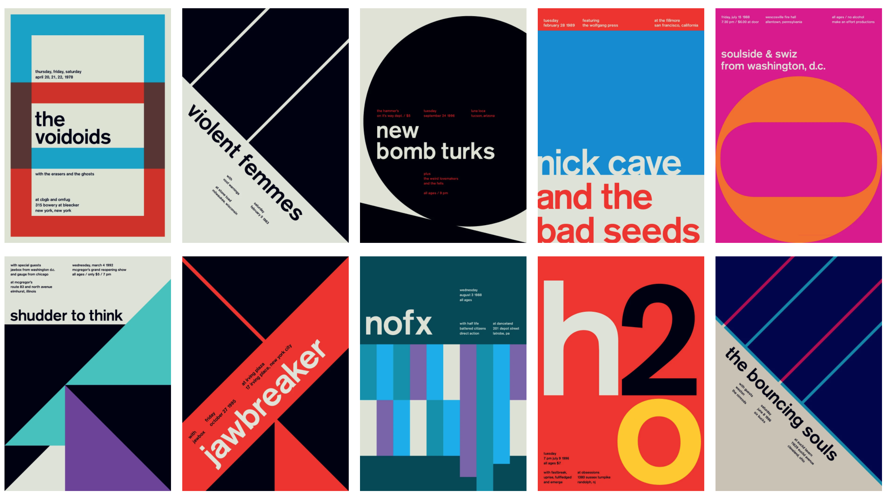

# Swiss Design

Recreate your favorite example of Swiss Design

## Instructions

Learning Objectives

Students who complete this assignment will be able to:

- List major themes and influences from modernist "Swiss" design movement.
- Explain essential processes of modern web design like responsive layouts, breakpoints, layout grids.
- Recreate a static design as a responsive web page using layout grids and Figma.
- Use HTML, CSS, JS and a responsive framework to code a custom web page design.

Preparation

Complete the following to prepare for this assignment. See [Resources](#resources) for additional information as needed.

- [Figma Design Lessons](https://www.figma.com/resources/learn-design/lessons/)
- [Codecademy: CSS 4-1 Color](https://www.codecademy.com/learn/learn-css) (1-8)
- [Codecademy: CSS 5-1 Typography](https://www.codecademy.com/learn/learn-css) (1-19)

Rubric

See Moodle.

<!-- ## About

https://web.archive.org/web/20151024000243/http://swisscolors.net/ -->

## Assigment

### Setup

[Fork](https://docs.google.com/presentation/d/1vtK6LoqwF4rQQZZy-ovuEgsYUwwMRXsqDVMOjAPSBt0/edit#slide=id.gad119073e1_0_6) this repository and [clone](https://docs.google.com/presentation/d/1vtK6LoqwF4rQQZZy-ovuEgsYUwwMRXsqDVMOjAPSBt0/edit#slide=id.g9930d559e8_0_0) it to the `critical-web-design` folder on your machine.

### Design

1. Select an example of Swiss Design from [Swissted](https://www.swissted.com/) or [search for one](https://duckduckgo.com/?q=swiss+design+examples&iax=images&ia=images) that speaks to you
1. Recreate the design for desktop, tablet, and mobile.
    1. Use type, shape, pen, etc. tools in [Figma](https://figma.com) to recreate art in the design.
    1. Use a [layout grid for each device size](https://help.figma.com/hc/en-us/articles/360040450513-Create-layout-grids-with-grids-columns-and-rows) in Figma.
    1. The parts of your layout that use columns should fit within the Bootstrap grid layout.
    1. Refer to the [Web Typography & Swiss Design slides](https://docs.google.com/presentation/d/10cE33DrhL79NI6ypYxT8epK34e5a6ZE5j6Oj2Gk1krQ/edit#slide=id.g4f07d111a9_0_0) as needed.

### Code

1. Use HTML, CSS, [SVG](https://www.youtube.com/watch?v=emFMHH2Bfvo), and JS to code your design inside `index.html`
1. For the column areas in the design
    1. Retype all text from the example you chose.
    1. Use the [Bootstrap documentation](https://getbootstrap.com/docs/) as well as custom CSS for the columns in your design
    1. Make the band name a link to the page of the original design (ensure the style still matches the poster)
1. For the art in the design
    1. You may use SVGs to render the art in the poster but do not add raster image files.
    1. Use CSS `position`, `border`, and `translate()` properties to create and rotate lines
1. Use JS `console.log()` to show credits: the original author of the design, and yourself

### Before you submit

Check your project on your phone, as well as the responsive devices inside Chrome DevTools. For each breakpoint:

1. Does the design either exactly match the original, or somehow improve it (alterations to make it work at smaller sizes)
1. Can you read all the text at all breakpoints?
1. Are any text or graphic elements overlapping or awkward?

### Publish

1. [Save and refresh](https://github.com/omundy/learn-computing/blob/main/topics-keyboard-shortcuts.md#web-development-edit-save-refresh-loop) your work in the browser often to see your changes.
1. Commit changes regularly.
1. Confirm valid [HTML](https://validator.w3.org/) and [CSS](https://jigsaw.w3.org/css-validator/) ([?](https://github.com/omundy/dig245-critical-web-design/blob/main/topics/html-css/css.md#css-validation))
1. When finished, [push, publish, and post your project](https://docs.google.com/document/d/17U_zmzM_eML_qkG0PaOdDRcEk3YEmbiQ1TyNnbAM08k/edit#bookmark=id.8jryplv1i8a). Make sure to include a link to your Figma designs in the Moodle post.

## Resources

- Course references [HTML](https://github.com/omundy/dig245-critical-web-design/blob/main/topics/html-css/html.md), [CSS](https://github.com/omundy/dig245-critical-web-design/blob/main/topics/html-css/css.md), and [JS](https://github.com/omundy/dig245-critical-web-design/blob/main/topics/javascript/javascript.md)
- Bootstrap [documentation](https://getbootstrap.com/docs/)
- W3Schools [CSS 2D Transforms](https://www.w3schools.com/Css/css3_2dtransforms.asp)
